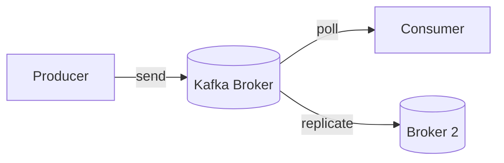
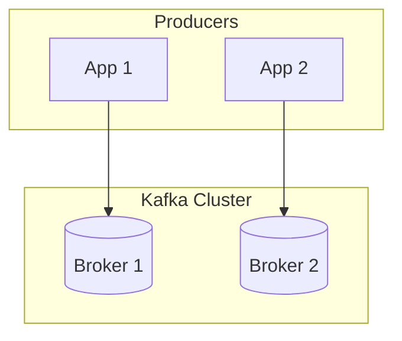
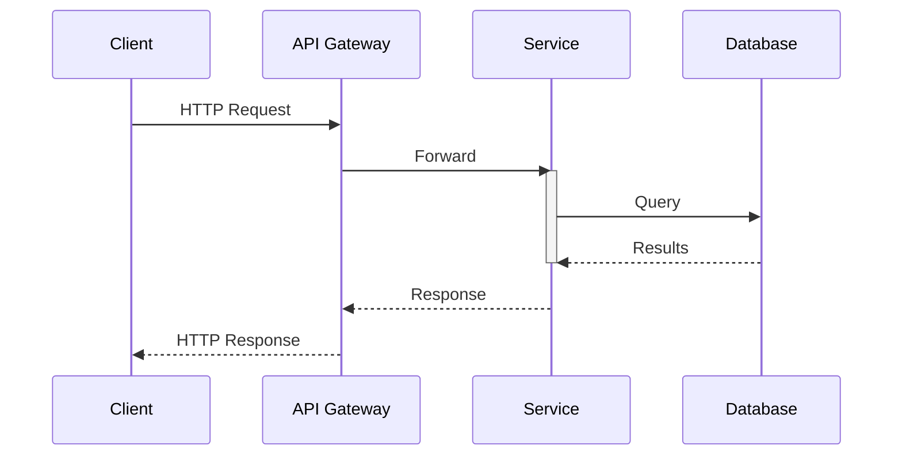
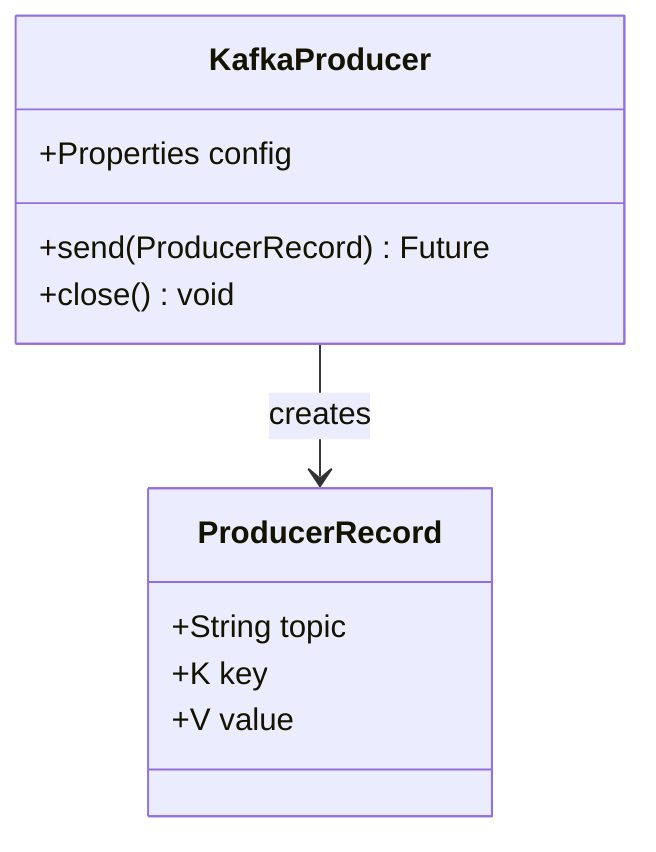
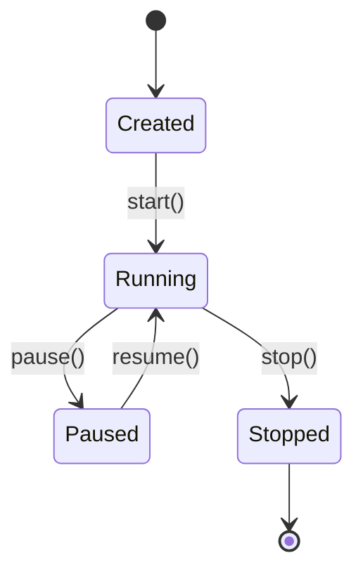
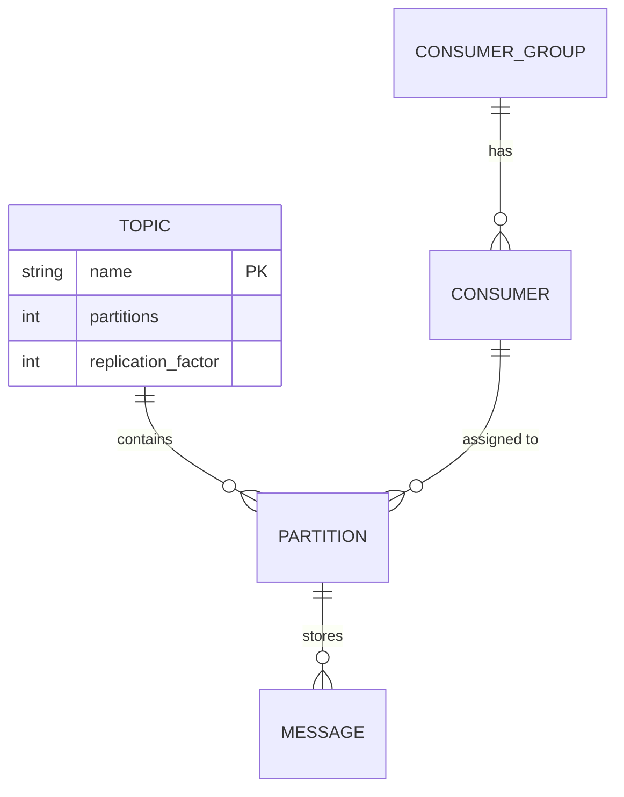
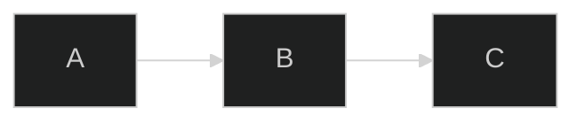
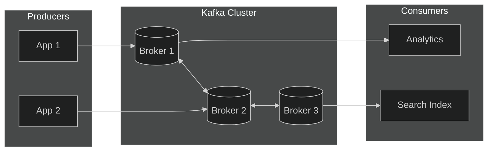

# presenterm Slide Creator

Create presentations in presenterm's markdown format — a tool that renders
markdown files as rich slides directly in the terminal.

**Output**: A single `.md` file that the user runs with `presenterm slides.md`.

---

## Quick Reference: Slide Structure

### Frontmatter (YAML between `---` fences at the top)

Every presentation should start with frontmatter:

```yaml
---
title: "My Presentation Title"
sub_title: Optional subtitle
author: Author Name
theme:
  name: dark
---
```

The frontmatter generates an **introduction slide** automatically. All fields are
optional. The `title` field supports inline markdown (`**bold**`, `_italic_`,
`<span>` tags).

For multiple authors:

```yaml
---
title: Our Talk
authors:
  - Alice
  - Bob
---
```

### Slide Separator

Slides are separated by the HTML comment:

```
<!-- end_slide -->
```

**Not** `---` (thematic breaks). The `---` separator can optionally be enabled
via `options: end_slide_shorthand: true` in the frontmatter, but the default
and recommended approach is `<!-- end_slide -->`.

### Slide Titles (Setext Headers)

Use setext-style headers for slide titles — they render centered with special
styling:

```
My Slide Title
===
```

or

```
My Slide Title
---
```

Regular ATX headers (`# H1`, `## H2`, etc.) render as normal markdown headings
within a slide and are NOT treated as slide titles.

---

## Comment Commands

presenterm uses HTML comments as commands. These are the most important ones:

| Command | Purpose |
|---------|---------|
| `<!-- end_slide -->` | End current slide, start next |
| `<!-- pause -->` | Pause — content below appears on next keypress |
| `<!-- jump_to_middle -->` | Vertically center subsequent content |
| `<!-- new_line -->` | Insert a blank line |
| `<!-- new_lines: N -->` | Insert N blank lines |
| `<!-- column_layout: [3, 2] -->` | Define column layout with proportional widths |
| `<!-- column: 0 -->` | Switch to column 0 (zero-indexed) |
| `<!-- reset_layout -->` | End column layout, return to full width |
| `<!-- incremental_lists: true -->` | Each bullet appears on separate keypress |
| `<!-- incremental_lists: false -->` | Turn off incremental lists |
| `<!-- no_footer -->` | Hide footer on this slide |
| `<!-- font_size: 2 -->` | Change font size (1-7, kitty terminal only) |
| `<!-- alignment: center -->` | Align text: `left`, `center`, or `right` |
| `<!-- skip_slide -->` | Exclude this slide from presentation |
| `<!-- speaker_note: Your note -->` | Add speaker note (visible in presenter mode) |
| `<!-- include: other.md -->` | Include content from another markdown file |
| `<!-- list_item_newlines: 2 -->` | Extra spacing between list items |

### User Comments (ignored by presenterm)

```
<!-- // This is a personal note, not rendered -->
<!-- comment: This is also ignored during rendering -->
```

---

## Column Layouts

Split slides into columns using `column_layout`, `column`, and `reset_layout`:

```markdown
Overview
===

<!-- column_layout: [2, 1] -->

<!-- column: 0 -->

Here is some content on the left taking 2/3 of the width.

* Point one
* Point two

<!-- column: 1 -->


<!-- reset_layout -->

This text spans full width below the columns.
```

**How sizing works**: `[2, 1]` means total = 3 units. Column 0 = 2/3 width,
Column 1 = 1/3 width. Use any numbers: `[1, 1]` for equal halves, `[1, 2, 1]`
for a centered middle column at 50%.

**Centering trick**: Use `[1, 3, 1]` and only write into column 1 to center
content at 60% width.

---

## Code Blocks

Standard fenced code blocks with language identifiers:

````markdown
```rust
fn main() {
    println!("Hello, presenterm!");
}
```
````

### Selective Highlighting

Highlight specific lines using braces after the language:

````markdown
```rust {1,3,5-7}
fn potato() -> u32 {       // 1: highlighted
    let x = 10;            // 2: not highlighted
    println!("Hello");     // 3: highlighted
    let mut q = 42;        // 4: not highlighted
    q = q * 1337;          // 5: highlighted
    q                      // 6: highlighted
}                          // 7: highlighted
```
````

### Dynamic Highlighting (Progressive Reveal)

Use `|` to separate highlight groups — each group appears on successive keypress:

````markdown
```rust {1,3|5-7|all}
fn potato() -> u32 {
    println!("Hello");
    let mut q = 42;
    q = q * 1337;
    q
}
```
````

First press: lines 1,3 highlighted. Next: lines 5-7. Next: all lines.

### Code Execution

Mark a block as executable with `+exec` (requires `-x` flag when running):

````markdown
```python +exec
print("Hello from Python!")
```
````

### Code Block Attributes

| Attribute | Effect |
|-----------|--------|
| `+exec` | Make executable (ctrl+e to run) |
| `+exec_replace` | Auto-execute and replace block with output |
| `+line_numbers` | Show line numbers |
| `+no_background` | Remove code block background |
| `+render` | Render mermaid/LaTeX/typst/d2 as images |
| `+acquire_terminal` | Give full terminal to executed program |

### External File Snippets

````markdown
```file +exec +line_numbers
path: snippet.rs
language: rust
start_line: 5
end_line: 10
```
````

### Hidden Lines (for execution)

Prefix lines with `# ` to hide them from display but include in execution:

````markdown
```rust +exec
# use std::thread::sleep;
# use std::time::Duration;
fn main() {
    println!("visible code only");
}
```
````

---

## Images and Diagrams

### Static Images

Standard markdown image syntax:

```markdown

```

Image sizing uses the `image:` prefix in alt text:

```markdown


```

Width can be a percentage or pixel count. Images render in terminals that
support image protocols (kitty, iTerm2, wezterm, ghostty, foot).

### Rendering Diagrams Inline

presenterm renders diagrams inline via the `+render` attribute on fenced code
blocks. The diagram source is converted to an image at load time. The two
primary diagram languages are **Mermaid** and **D2**.

### Choosing Between Mermaid and D2

| Factor | D2 | Mermaid |
|--------|-----|---------|
| Best for | Architecture, infra, styled diagrams | Broad variety, quick sketches |
| Styling | Rich (fill, stroke, shadow, 3D, globs) | Moderate (classDef, themes) |
| Unique types | Grid diagrams, SQL tables, classes | Gantt, pie, mindmap, gitGraph, journey, timeline |
| Sequence diagrams | Built-in | Built-in with richer control flow |
| Layout engines | dagre, ELK, TALA | dagre, ELK |
| Rendering | CLI: `d2 input.d2 output.svg` | CLI: `mmdc -i input.mmd -o output.svg` |

Use **D2** for polished architecture diagrams with fine-grained styling.
Use **Mermaid** for Gantt charts, mindmaps, pie charts, or rapid flowcharts.

---

### Mermaid Diagrams

Use `mermaid +render` on a fenced code block. Requires `mermaid-cli` (`mmdc`).

#### Flowchart

````markdown

````

Directions: `LR` (left-right), `TD`/`TB` (top-down), `BT`, `RL`.

Node shapes: `A[Rectangle]`, `B(Rounded)`, `C([Stadium])`, `D[(Cylinder)]`,
`E((Circle))`, `F{Diamond}`, `G{{Hexagon}}`, `H[/Parallelogram/]`.

Edge types: `-->` arrow, `---` line, `-.->` dotted, `==>` thick, `<-->` bidirectional.
Labels: `-->|text|` or `-- text -->`.

Subgraphs group nodes:

````markdown

````

#### Sequence Diagram

````markdown

````

Arrows: `->>` solid, `-->>` dotted, `-x` cross, `-)` async open.
Blocks: `loop`, `alt`/`else`, `opt`, `par`/`and`, `critical`, `break`.
Use `activate`/`deactivate` or `+`/`-` suffixes for activation boxes.
`autonumber` adds sequence numbers. `Note right of X: text` adds notes.

#### Class Diagram

````markdown

````

Visibility: `+` public, `-` private, `#` protected, `~` package.
Relationships: `<|--` inheritance, `*--` composition, `o--` aggregation,
`-->` association, `..>` dependency, `..|>` realization.

#### State Diagram

````markdown

````

Composite states: `state Active { ... }`. Choice: `<<choice>>`.
Fork/join: `<<fork>>`, `<<join>>`.

#### Entity-Relationship Diagram

````markdown

````

Cardinality: `||` exactly one, `o|` zero or one, `}|` one or more,
`o{` zero or more. Line: `--` identifying, `..` non-identifying.

#### Other Mermaid Types

**Gantt chart**: `gantt` with `dateFormat`, `section`, and task declarations.
**Pie chart**: `pie title "Title"` with `"Label" : value` entries.
**Mindmap**: `mindmap` with indentation-based hierarchy.
**Git graph**: `gitGraph` with `commit`, `branch`, `merge` commands.
**Journey map**: `journey` with `section` and tasks scored 1-5.

#### Mermaid Theming

Apply via init directive at the top of the block:

````markdown

````

Built-in themes: `default`, `neutral`, `dark`, `forest`, `base`.
The `base` theme supports `themeVariables` for full color customization
(hex colors only — color names are silently ignored).

#### Mermaid Pitfalls

- The word `end` as a node name breaks flowcharts — wrap it: `e[end]`
- No space between node ID and bracket: `A[text]` not `A [text]`
- Parentheses in labels need HTML entities: `#40;` and `#41;`
- Theme engine only accepts hex colors, not color names
- Use meaningful node IDs (`DATABASE` not `A`) for readability

---

### D2 Diagrams

Use `d2 +render` on a fenced code block. Requires `d2` CLI installed.

#### Basic Shapes and Connections

````markdown
```d2 +render
Producer -> Kafka Broker: publish
Kafka Broker -> Consumer: subscribe
Kafka Broker -> Storage: persist

Producer.shape: rectangle
Storage.shape: cylinder
```
````

Shapes: `rectangle` (default), `square`, `circle`, `oval`, `diamond`,
`hexagon`, `cloud`, `cylinder`, `queue`, `package`, `page`, `document`,
`parallelogram`, `step`, `callout`, `stored_data`, `person`, `text`, `image`.

Connections: `->` directed, `<-` reverse, `<->` bidirectional, `--` undirected.
Chain: `a -> b -> c`. Labels: `a -> b: label text`.

#### Containers (Nesting)

````markdown
```d2 +render
direction: right

Backend: Backend Services {
    api: API Server
    worker: Background Worker
    db: Database {
        shape: cylinder
    }
    api -> worker: enqueue
    worker -> db: persist
}

Frontend: Web App {
    ui: React UI
    state: State Store
}

Frontend.ui -> Backend.api: REST calls
```
````

Any shape with children becomes a container. Use dot notation for flat
references: `server.process`. Connect across containers with full paths.

#### Styling

````markdown
```d2 +render
direction: right

kafka: Apache Kafka {
    style: {
        fill: "#2A2A2A"
        stroke: "#E8488B"
        border-radius: 8
        font-color: "#FFFFFF"
    }
    broker1: Broker 1
    broker2: Broker 2
    broker1 <-> broker2: replicate {
        style: {
            stroke: "#4ECDC4"
            animated: true
        }
    }
}

producer: Producer {
    style.fill: "#4A90D9"
    style.font-color: white
}

producer -> kafka.broker1: publish {
    style.stroke-dash: 3
}
```
````

Key style properties: `fill` (background), `stroke` (border/line color),
`stroke-width` (1-15), `stroke-dash` (0-10), `border-radius` (0-20),
`shadow` (true/false), `3d` (rectangles only), `multiple` (stacked effect),
`opacity` (0-1), `font-size` (8-100), `font-color`, `font: mono`,
`bold`, `italic`, `animated` (connections only), `fill-pattern` (dots/lines/grain).

#### Reusable Classes and Globs

```d2
classes: {
    service: {
        style: { fill: "#264653"; font-color: white; border-radius: 8 }
    }
    database: {
        shape: cylinder
        style: { fill: "#2A9D8F"; font-color: white }
    }
}

api: API { class: service }
auth: Auth Service { class: service }
db: PostgreSQL { class: database }
```

Globs apply styles broadly: `*.style.fill: "#333"` sets all shapes.
Double globs (`**`) apply recursively into nested containers.

#### SQL Tables / ER Diagrams

````markdown
```d2 +render
topics: Topics {
    shape: sql_table
    id: int {constraint: primary_key}
    name: varchar
    partitions: int
    replication: int
}

messages: Messages {
    shape: sql_table
    id: bigint {constraint: primary_key}
    topic_id: int {constraint: foreign_key}
    key: bytea
    value: bytea
    timestamp: bigint
}

topics.id <-> messages.topic_id
```
````

#### Sequence Diagrams

````markdown
```d2 +render
shape: sequence_diagram

client: Client
gateway: API Gateway
service: Order Service
kafka: Kafka

client -> gateway: POST /orders
gateway -> service: createOrder()
service -> kafka: produce("orders", event)
kafka -> service: ack
service -> gateway: 201 Created
gateway -> client: Response
```
````

#### Icons and Images

```d2
aws: AWS {
    icon: https://icons.terrastruct.com/aws%2F_Group%20Icons%2FAWS-Cloud-alt_light-bg.svg
}
```

Use `icon: <url>` on any shape. Use `shape: image` for standalone images.
Free icons at https://icons.terrastruct.com.

#### D2 Layout and Direction

Set global direction: `direction: right` (options: `up`, `down`, `left`, `right`).

Layout engines (set via CLI `--layout` flag):
- **dagre** (default) — fast hierarchical, based on Graphviz DOT
- **ELK** — mature academic engine, clean orthogonal routing
- **TALA** — commercial engine, best for software architecture diagrams

#### D2 Variables

```d2
vars: {
    primary: "#4A90D9"
    accent: "#E8488B"
}

service: My Service {
    style.fill: ${primary}
    style.stroke: ${accent}
}
```

---

### Rendering: LaTeX and Typst

Use `+render` to convert formulas into images inline:

````markdown
```latex +render
\frac{n!}{k!(n-k)!} = \binom{n}{k}
```
````

````markdown
```typst +render
$ sum_(k=0)^n binom(n, k) = 2^n $
```
````

**Requirements**: `latex` for LaTeX, `typst` for typst.

### Diagram Sizing Tips for Terminal Slides

Terminal presentations have constrained viewport width. Follow these rules:
- Keep diagrams focused: **5-10 nodes** per diagram maximum
- Use `LR` (left-right) direction for wide terminals, `TD` for tall content
- Split complex architectures across multiple slides using progressive reveal
  (show the same diagram building up across slides)
- In mermaid, set `%%{init: {'theme': 'dark'}}%%` to match dark slide themes
- In D2, coordinate `style.fill` and `style.font-color` with your slide theme

---

## Text Formatting

All standard markdown formatting works:

- **Bold**: `**text**`
- *Italic*: `*text*`
- ~~Strikethrough~~: `~~text~~`
- `Inline code`: `` `code` ``
- [Links](url): `[text](url)`
- Block quotes: `> quoted text`
- Tables: standard markdown table syntax

### Colored Text

Use `<span>` tags with inline styles:

```html
<span style="color: #ff0000">Red text</span>
<span style="color: #00ff00; background-color: #000000">Green on black</span>
```

Colors can reference theme palette:

```html
<span style="color: palette:red">themed red</span>
<span class="my_class">class-based coloring</span>
```

**Only `<span>` tags are supported** — no `<div>`, `<p>`, etc.

---

## Pauses and Incremental Content

### Manual Pauses

```markdown
First this appears.

<!-- pause -->

Then this appears on next keypress.

<!-- pause -->

And finally this.
```

### Incremental Lists

```markdown
<!-- incremental_lists: true -->

* First bullet (appears alone)
* Second bullet (appears on next keypress)
* Third bullet

<!-- incremental_lists: false -->
```

---

## Speaker Notes

```markdown
<!-- speaker_note: Remember to mention the demo here -->
```

Run with `-P` to publish speaker notes, and use `-l` on another terminal to
view them.

---

## Themes and Fonts

### Built-in Themes

Set in frontmatter:

```yaml
---
theme:
  name: catppuccin-mocha
---
```

Available themes:
- `catppuccin-latte`, `catppuccin-frappe`, `catppuccin-macchiato`, `catppuccin-mocha`
- `dark`, `light`
- `gruvbox-dark`
- `terminal-dark`, `terminal-light` (inherit terminal colors)
- `tokyonight-storm`, `tokyonight-moon`, `tokyonight-day`, `tokyonight-night`

**Choosing a theme**: `catppuccin-mocha` and `dark` are safe defaults for dark
terminals. Use `terminal-dark` if you want the presentation to inherit your
terminal's colors (including transparent backgrounds). Use `light` or
`catppuccin-latte` for light terminal backgrounds.

### Theme Overrides in Frontmatter

```yaml
---
theme:
  override:
    default:
      colors:
        foreground: "e6e6e6"
        background: "040312"
      margin:
        percent: 8
    slide_title:
      padding_bottom: 1
      padding_top: 1
      separator: true
    headings:
      h1:
        bold: true
      h2:
        italic: true
    code:
      theme_name: base16-eighties.dark
      padding:
        horizontal: 2
        vertical: 1
    footer:
      style: progress_bar
---
```

### Font Size

presenterm supports font sizes in kitty terminal (v0.40.0+). Set via theme
for slide titles/headings, or per-slide via command:

```
<!-- font_size: 2 -->
```

Range: 1 (default) to 7. All built-in themes set slide titles and headings
to font_size 2.

### Footer Configuration

```yaml
---
theme:
  override:
    footer:
      style: template
      left: "My Company"
      center: "_Confidential_"
      right: "{current_slide} / {total_slides}"
      height: 3
---
```

Footer styles: `template` (custom left/center/right), `progress_bar`,
`empty` (no footer). Footer images are supported — use `left: image: logo.png`.

### Color Palette

Define reusable colors in your theme override:

```yaml
---
theme:
  override:
    palette:
      classes:
        accent:
          foreground: "E8488B"
        success:
          foreground: "4ECDC4"
        warning:
          foreground: "F7B801"
---
```

Then use in slides: `<span class="accent">highlighted term</span>`.
Or reference in styles: `<span style="color: palette:accent">text</span>`.

### Coordinating Diagram Themes with Slide Themes

Match your diagram colors to your slide theme for visual coherence:
- For mermaid on dark themes: use `%%{init: {'theme': 'dark'}}%%`
- For D2 on dark themes: set `style.fill` backgrounds to dark values and
  `style.font-color` to light values
- For D2, use `--theme` CLI flag or in-file variables to control palette
- Keep fonts consistent — monospace in both code blocks and diagrams creates
  the most natural terminal aesthetic

---

## Separator / Section Slides

Create visually distinct section dividers:

```markdown
<!-- end_slide -->

<!-- jump_to_middle -->

Next Section
===

<!-- end_slide -->
```

This centers the title vertically — great for section breaks.

---

## Options in Frontmatter

```yaml
---
options:
  end_slide_shorthand: true    # Allow --- as slide separator
  implicit_slide_ends: true    # Auto-end slides on headings
  command_prefix: "cmd:"       # Require prefix for commands
  image_attributes_prefix: ""  # Change image sizing prefix
  list_item_newlines: 1        # Default spacing between list items
---
```

---

## Exporting

```bash
presenterm -e slides.md            # Export to PDF
presenterm -E slides.md            # Export to HTML
presenterm -e slides.md -o out.pdf # Custom output path
```

---

## Running Presentations

```bash
presenterm slides.md             # Development mode (hot reload)
presenterm -p slides.md          # Presentation mode
presenterm -t dark slides.md     # Override theme via CLI
presenterm -x slides.md          # Enable code execution
presenterm -P slides.md          # Publish speaker notes
presenterm -l                    # Listen for speaker notes (other terminal)
```

---

## Presentation Design Patterns

These patterns are drawn from the *Presentation Patterns* framework by
Neal Ford, Matthew McCullough, and Nathaniel Schutta. Apply them when
structuring slides for conference talks and technical presentations.

### Structure and Storytelling

**Narrative Arc** — Structure every talk as a story: setup (the problem),
confrontation (the complexity), resolution (the solution). This is the single
most important pattern. Use `<!-- pause -->` and incremental reveals to build
tension before the resolution slide.

**Triad** — Refine the arc into three acts. The "gloomy end of the second act"
creates maximum tension before your solution/insight arrives.

**Foreshadowing** — Plant hints early: "We'll see later why this choice matters."
Creates forward momentum. Add these as brief text lines before `<!-- pause -->`.

**The Big Why** — Establish in the first two minutes why the audience should care.
Developer audiences are practical — they check out without clear motivation.
Make your second slide answer "why should I care about this?"

**Bookends** — Match opening and closing slides with the same visual treatment
and core message. Open with the problem; close by revisiting it with the
solution in place.

### Building Slides

**Gradual Consistency** — Build information step by step rather than showing
the finished version immediately. For architecture diagrams, reveal components
incrementally across multiple slides. Use `<!-- pause -->` between diagram
stages or create a series of slides where each adds one more component.

**Charred Trail** — When walking through a list, highlight the current item
while graying out previous ones. Use dynamic code highlighting (`{1-3|5-7|all}`)
for code, and `<span>` color tags for prose lists.

**Emergence** — Let the solution materialize before the audience's eyes rather
than lecturing. Build up to the "aha" moment using pauses and progressive reveal.

**Expansion Joints** — Mark sections as cuttable in advance so you can adapt
to time constraints. Use `<!-- speaker_note: CUTTABLE -->` on optional slides.

**Intermezzi** — Use clear visual dividers between major sections. The
`<!-- jump_to_middle -->` + setext title pattern is perfect for this in
presenterm.

**Context Keeper / Breadcrumbs** — Show a visual overview highlighting the
current position within a complex multi-topic talk. Create a "roadmap" slide
and revisit it between sections with the current section highlighted.

### Code Demos

**Cave Painting** — Script every demo step in advance like a storyboard. Know
exactly what you'll type, click, and show. Use `<!-- speaker_note: ... -->`
to script each step.

**Traveling Highlights** — Direct attention to the relevant 3 lines out of 50.
Use dynamic highlighting (`{1-3|5-7|all}`) and selective highlighting to walk
through code step by step. **Never show a wall of code all at once.**

**Crawling Code** — Reveal code line by line or block by block with narration.
Combine `+exec` with dynamic highlighting for live execution at each stage.

**Lipsync** — Pre-record the demo while narrating live, eliminating failure
risk. Export key frames as screenshots and embed as images with ``.

### Audience Engagement

**Brain Breaks** — Insert mental pauses every 10-15 minutes of dense content.
A story, a joke, a change in visual rhythm. In presenterm, this can be an
image slide, a quote, or a section divider.

**Breathing Room** — After showing a complex architecture diagram, stop talking
for 3-5 seconds. Let it sink in. Add `<!-- pause -->` after diagram slides.

**Seeding the First Question** — Have a colleague ready to break the Q&A
silence. Add `<!-- speaker_note: SEED: ask about scaling -->` as a reminder.

### Antipatterns to Avoid

**Bullet-Riddled Corpse** — Every slide as a bullet list read aloud. The #1
antipattern. Use visual slides with the presenter supplying the verbal channel.
Use images, diagrams, and progressive reveal instead.

**Ant Fonts** — Unreadable tiny text, especially code. If it can't be read
from the back of the room, remove it. In presenterm, keep code blocks under
15 lines and use `<!-- font_size: 2 -->` in kitty.

**Dead Demo** — Wasting time on environment setup and tool proficiency. If
the demo is mostly boilerplate, put it on slides instead. Only go live when
genuine interaction matters.

**Slideuments** — Trying to make slides serve as both a presentation and a
standalone document. This always fails. Make a presentation OR a document.

**Cookie Cutter** — Forcing every idea into exactly one slide. Some ideas need
multiple slides; some slides can hold multiple related points.

**Going Meta** — "On this next slide I'm going to show you..." Just show it.

**Fontaholic** — Too many fonts. Stick to 2-3 complementary fonts maximum.
In presenterm, the terminal font is your primary — keep it consistent.

**Floodmarks** — Logos and branding consuming valuable slide real estate.
Use footer for minimal branding, keep the slide body for content.

---

## Complete Example

Below is a full example presentation showcasing diagrams, patterns, and features:

```markdown
---
title: "**Streaming** Data with _Kafka_"
sub_title: A quick introduction
author: Viktor Gamov
theme:
  name: catppuccin-mocha
  override:
    footer:
      style: template
      right: "{current_slide} / {total_slides}"
      height: 2
---

<!-- speaker_note: THE BIG WHY - establish motivation immediately -->

Why Streaming?
===

Every business is becoming a real-time business.

<!-- pause -->

Batch processing means **hours of delay**.
Event streaming means **milliseconds**.

<!-- pause -->

Let's see how Apache Kafka makes this possible.

<!-- end_slide -->

What is Kafka?
===

<!-- incremental_lists: true -->

* **Producers** send events to topics
* **Consumers** read events from topics
* **Brokers** store and replicate the data
* Events are **immutable** and **ordered** within a partition

<!-- end_slide -->

Architecture
===



<!-- end_slide -->

<!-- jump_to_middle -->

Demo Time
===

<!-- speaker_note: Cave Painting - scripted demo steps below -->

<!-- end_slide -->

Producer Code
===

```java {1-3|5-8|10-13|all}
import org.apache.kafka.clients.producer.*;

Properties props = new Properties();
props.put("bootstrap.servers", "localhost:9092");

Producer<String, String> producer =
    new KafkaProducer<>(props);

producer.send(new ProducerRecord<>(
    "my-topic", "key", "value"
));

producer.close();
```

<!-- speaker_note: Traveling Highlights - walk through each block -->

<!-- end_slide -->

Data Model
===

```d2 +render
direction: right

topics: Topics {
    shape: sql_table
    id: int {constraint: primary_key}
    name: varchar
    partitions: int
}

messages: Messages {
    shape: sql_table
    id: bigint {constraint: primary_key}
    topic_id: int {constraint: foreign_key}
    key: bytea
    value: bytea
}

topics.id <-> messages.topic_id
```

<!-- end_slide -->

Summary
===

<!-- alignment: center -->

Kafka enables real-time data streaming at scale.

**Thank you!**

Questions?
```

---

## Writing Guidelines for Creating Presentations

When creating presenterm slides:

1. **Start with frontmatter** — Always include title, author, and theme.
2. **Use `<!-- end_slide -->` consistently** — Don't mix separators.
3. **Use setext headers for slide titles** — `Title\n===` not `# Title`.
4. **Structure as Narrative Arc** — Setup → confrontation → resolution.
5. **Use Gradual Consistency** — Reveal content progressively with pauses.
6. **Use incremental_lists for bullet-heavy slides** — Avoids manual pauses.
7. **Use column layouts for side-by-side content** — Code + explanation, image + text.
8. **Use `<!-- jump_to_middle -->` for section breaks** — Creates Intermezzi dividers.
9. **Add speaker notes** — Script demos (Cave Painting) and mark cuttable sections.
10. **Keep slides focused** — One main idea per slide. Avoid Bullet-Riddled Corpse.
11. **Use dynamic code highlighting** — Traveling Highlights with `{1-3|5-8|all}`.
12. **Use diagrams** — Mermaid for flowcharts/sequences, D2 for architecture/ER.
13. **Coordinate theme colors** — Match diagram themes to slide themes.
14. **Insert Brain Breaks** — Every 10-15 minutes of dense content.
15. **Save the file as `.md`** — The user runs it with `presenterm filename.md`.
